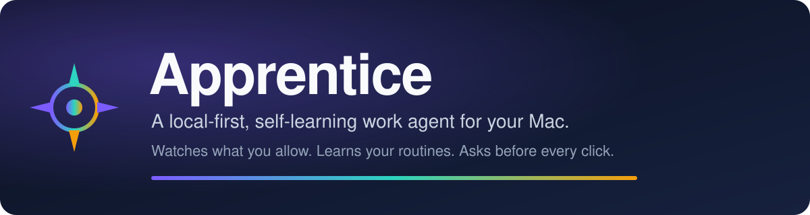
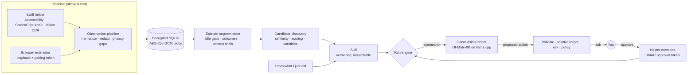
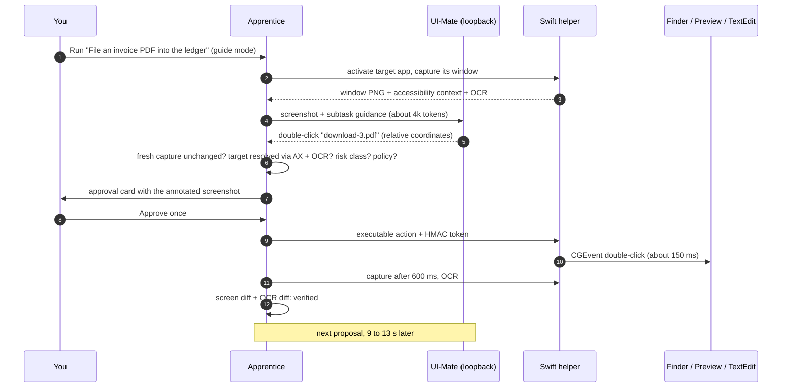

<p align="center">
  
</p>

<p align="center">
  <a href="https://github.com/bluzername/apprentice/actions/workflows/ci.yml"></a>
  <a href="LICENSE"></a>
  
  
  
  
  
</p>

<p align="center">
  <b>Apprentice watches the apps you allow, notices the routines you repeat, explains what it learned, and then does them with you, one approved click at a time.</b><br>
  Everything stays on your Mac, encrypted. The vision model runs on loopback. Nothing acts without your approval.
</p>

<p align="center">
  <a href="#quick-start">Quick start</a> ·
  <a href="#how-it-works">How it works</a> ·
  <a href="#what-a-run-looks-like">What a run looks like</a> ·
  <a href="#measured-on-a-real-mac">Measured on a real Mac</a> ·
  <a href="#privacy-invariants">Privacy</a> ·
  <a href="#hardware-requirements">Hardware</a> ·
  <a href="#status-and-roadmap">Roadmap</a> ·
  <a href="docs/">Docs</a>
</p>

---

## Why

Most "AI agents for your computer" start from a prompt and improvise. Apprentice starts from
**you**. It observes only allowlisted apps and domains, segments what it sees into episodes,
finds sequences you have done more than once, and turns them into inspectable, versioned
skills. When you run a skill, a local GUI model proposes the next action, a deterministic engine
validates it, classifies the risk, and asks you before anything touches the screen.

It is built for people who want the leverage of automation without handing their screen to a
cloud service.

## Features

| | |
|---|---|
| **Allowlist-first observation** | Nothing is captured for apps or browser domains you did not enable. Focus elsewhere only produces a `privacy_gap` marker. |
| **Passive routine discovery** | Repeated, goal-directed sequences (minimum two occurrences, three meaningful actions, 90 s of active work) become candidates with evidence, confidence, detected variables and a risk badge. |
| **"Learn what I just did"** | A global shortcut turns the last few minutes into a skill draft with a range editor, retention preview and editable subtasks. |
| **Skills you can read** | Every skill is a versioned document: trigger, preconditions, subtasks with completion criteria, allowed apps and domains, policy, corrections. |
| **Guided runs** | The model proposes, the engine verifies the screen is unchanged, resolves the target through Accessibility and OCR, classifies risk, and asks. Approved actions go to a Swift helper with an HMAC token minted for that exact action. |
| **Deterministic verification** | Before and after captures, perceptual hashes, OCR diffs and DOM markers decide whether a step worked. Model opinions are supporting evidence only. |
| **Encrypted local store** | SQLite plus AES-256-GCM blobs under a keychain-protected master key. Screenshots are sparse (at most one per five seconds outside a run) and deduplicated. |
| **Local model, replaceable** | An exact port of Tencent's UI-Mate agent protocol runs against a managed llama.cpp server on 127.0.0.1. Any OpenAI-compatible endpoint works too. Demo mode needs no model at all. |
| **Pause, private mode, delete** | Menu bar controls that produce zero events and zero screenshots, verified on a real machine. Delete today or delete everything from the Privacy page. |
| **Structured feedback, off by default** | Remote feedback is opt-in, allowlist-only, previewed before upload, and never contains screenshots, OCR, URLs, titles or free text. |

## Quick start

Apple Silicon, macOS 14 or newer, Node 22.12+ (24 recommended), pnpm 10, and Xcode Command
Line Tools with Swift 6.

```bash
git clone https://github.com/bluzername/apprentice.git
cd apprentice
pnpm install
node scripts/build-helper.mjs        # Swift helper -> apps/desktop/resources/helper
pnpm --filter @apprentice/desktop dev   # opens the app in demo mode (no model needed)
```

To build the shareable alpha (`.dmg`, `.zip`, browser extension, docs, checksums):

```bash
pnpm lint && pnpm typecheck && pnpm test
pnpm build
pnpm package:mac
pnpm alpha:bundle                    # dist/alpha/
pnpm alpha:smoke                     # verifies the bundle without downloading a model
```

<details>
<summary><b>Run the real model (optional, 8.6 GB download)</b></summary>

```bash
node scripts/install-local-runtime.mjs          # pinned llama.cpp release, SHA-256 verified
node scripts/install-uimate-model.mjs --yes     # UI-Mate-9B Q6_K + mmproj, SHA-256 verified
node scripts/start-local-model.mjs --port 8000  # or let the app manage it: Settings > Model > Start
RUN_LOCAL_MODEL_TEST=1 pnpm test:local-model    # one real proposal against a synthetic screenshot
pnpm bench:local-model                          # latency, tokens and memory on your Mac
```

Nothing is installed system-wide, nothing runs before its checksum matches, and every file lives
under `~/Library/Application Support/Apprentice`. Full guide: [docs/MODEL_SETUP.md](docs/MODEL_SETUP.md).
</details>

## How it works



Six invariants hold the whole thing together:

1. **Allowlist first.** No capture outside the apps and domains you enabled.
2. **Never record keystrokes, secure fields, clipboard, or field values.**
3. **Screenshots are sparse, deduplicated by perceptual hash, and encrypted** under a
   keychain-protected master key.
4. **No cloud model in the default path.** Feedback upload is off, allowlist-only, and previewed.
5. **Model output never triggers an OS action directly:** parse, schema, deterministic validation,
   risk engine, policy, user approval, then the helper with an approval token.
6. **Hidden model reasoning is never persisted or displayed.**

## What a run looks like



That sequence is not a mock-up. It is the run recorded on 2026-09-03 in
[docs/BUILD_STATUS.md](docs/BUILD_STATUS.md): the double-click really opened the PDF in Preview,
the following Command+W really closed it, and a proposal aimed at a macOS permission dialog from
another app was refused by the hit-test guard because the element under the point did not belong
to the target app.

## Measured on a real Mac

All numbers below were recorded on an Apple M3 Max with 36 GB of unified memory, next to a
browser and other apps, with the pinned llama.cpp b10752 runtime and UI-Mate-9B Q6_K. Raw
benchmark reports live in [docs/benchmarks/](docs/benchmarks/); the method and every table are
in [docs/MODEL_PERFORMANCE.md](docs/MODEL_PERFORMANCE.md).

| What | Measured |
|---|---|
| Model ready after app launch (managed runtime auto-start) | 7 s |
| GPU memory held by the model at a 32k context | 11.2 to 11.7 GB |
| Prompt processing / generation speed | 220 to 400 tok/s / 32 tok/s |
| One proposed action, normal window (about 1,800 image tokens) | 9 to 13 s |
| One proposed action, maximized Retina window (capped at 1920 px) | 14 to 18 s |
| Execute an approved click / double-click / hotkey through the helper | 55 to 58 ms / 145 to 162 ms / 25 ms |
| Verify a step (capture, OCR, diffs) | about 0.5 s plus a 600 ms settle |
| Apprentice main process / native helper memory | 150 to 170 MB / 26 to 60 MB |

Running the real model changed the product. Ten defects that the mock provider could never show
up were found and fixed in one evening: the official 8k context overflowing on Retina
screenshots, the prompt cache being invalidated by the screenshot history policy, a 5 s
staleness rule that rejected every 10 s proposal, the Escape emergency stop swallowing the
helper's own Escape, and more. The list, with the fix for each, is in
[docs/BUILD_STATUS.md](docs/BUILD_STATUS.md#real-model-on-the-build-machine-2026-09-03-evening).

## Privacy invariants

<details>
<summary><b>What is captured, what is never captured, and what leaves the machine</b></summary>

| Captured (allowlisted apps and domains only) | Never captured | Leaves the machine |
|---|---|---|
| App activations and window titles (encrypted at rest) | Keystrokes and typed text | Nothing by default |
| Clicks with the accessibility role and name under the pointer | Secure input fields | With explicit consent only: a previewed feedback payload with counts, timings, categories and an optional user-warned comment |
| Command chords (cmd+S, cmd+W, ...) | Clipboard contents | Never: screenshots, OCR text, URLs, titles, free text |
| Sparse screenshots, perceptual-hash deduplicated, AES-256-GCM encrypted | Field values | |
| OCR text of those screenshots (retention-limited) | Anything outside the allowlist | |

Retention defaults: screenshots 24 hours, OCR 7 days, events 30 days. Pause for 15 minutes,
private mode, delete today, and delete everything are one click away.
Details: [docs/PRIVACY_MODEL.md](docs/PRIVACY_MODEL.md) and [docs/THREAT_MODEL.md](docs/THREAT_MODEL.md).
</details>

## Hardware requirements

| Unified memory | Verdict for the managed Q6_K route |
|---|---|
| 36 GB (tested) | Comfortable next to a browser, the app and other tools; free memory stayed above 25 percent. |
| 32 GB | Recommended. Same margins minus 4 GB. Not tested. |
| 24 GB | Minimum. About 11.5 GB for the model leaves roughly 12 GB for macOS and your apps; expect swapping with a heavy browser session. Not tested. |
| 16 GB | Not viable with Q6_K. Use `IQ4_XS` or `Q4_K_M` from the same repository with a 16k context, or point the app at an external endpoint. |

Inference is GPU-bound. Chips with fewer GPU cores will process screenshots proportionally
slower than the 30-core M3 Max measured here.

## Status and roadmap

Apprentice is an **alpha**. It has been exercised end to end on one machine, with a real model,
against real applications, and it is honest about what it cannot do yet.

**Works today**

- Onboarding, permissions, allowlists, real observation with encrypted screenshots and OCR
- Passive candidate discovery from a human-paced routine; candidate to skill; teach-by-shortcut
- Guided runs with the real local model: propose, validate, approve, execute, verify
- Pause, private mode, retention, delete; local feedback with an offline aggregator
- Signed arm64 `.dmg` and `.zip`, alpha bundle with checksums and a smoke test

**Next**

- Subtask completion the engine can evaluate itself (the model does not reliably emit the
  completion signal under skill guidance, so multi-subtask runs still need the user to stop them)
- Window-only capture (ScreenCaptureKit by window) so dialogs from other apps never enter the frame
- The browser extension exercised end to end in a real Chrome profile
- Notarization and a public alpha download

Known limitations are tracked in [docs/KNOWN_LIMITATIONS.md](docs/KNOWN_LIMITATIONS.md),
release notes in [docs/RELEASE_NOTES.md](docs/RELEASE_NOTES.md), and every tested fact in
[docs/BUILD_STATUS.md](docs/BUILD_STATUS.md).

## Repository layout

<details>
<summary><b>Monorepo map</b></summary>

```text
apps/desktop             Electron 42 + React + Vite desktop app (main owns SQLite, crypto, helper, runs, model)
apps/chromium-extension  MV3 companion extension: loopback only, pairing token, allowlisted capture
packages/schemas         Zod contracts for every process boundary; types are inferred, never duplicated
packages/core            Deterministic engine: normalize, redact, segment, score, risk, geometry, crypto, export
packages/model-adapters  Mock, OpenAI-compatible, and exact UI-Mate providers; opt-in real-model tests and benchmark
packages/test-fixtures   Synthetic scenarios, SVG screens, demo dataset
native/mac-helper        Swift helper: Accessibility, ScreenCaptureKit, CGEvent, Vision OCR, HMAC approval tokens
services/feedback-worker Cloudflare Worker + D1 for optional structured feedback (strict allowlist schema)
scripts/                 Bootstrap, model runtime install/start, alpha bundle, aggregator, smoke test
docs/                    Architecture, threat and privacy models, model setup, performance, ADRs, benchmarks
```

Commands: `pnpm lint`, `pnpm typecheck`, `pnpm test`, `pnpm test:e2e`, `pnpm build`,
`pnpm package:mac`, `pnpm alpha:bundle`, `pnpm alpha:smoke`, `pnpm test:local-model`,
`pnpm bench:local-model`.
</details>

## Contributing

Read [CONTRIBUTING.md](CONTRIBUTING.md) first: tests before code, privacy invariants are not
negotiable, no fake success states. Security reports go through
[SECURITY.md](SECURITY.md).

## Acknowledgements

- [Tencent UI-Mate](https://github.com/Tencent/UI-Mate) (Apache-2.0): the GUI agent protocol and
  the UI-Mate-9B checkpoint, vendored at a pinned commit and ported byte-for-byte.
- [llama.cpp](https://github.com/ggml-org/llama.cpp) (MIT): the local inference runtime.
- [bartowski](https://huggingface.co/bartowski/tencent_UI-Mate-9B-GGUF): the GGUF quantizations.

## License

Source in this repository: [Apache-2.0](LICENSE). Third-party notices:
[THIRD_PARTY_NOTICES.md](THIRD_PARTY_NOTICES.md).
