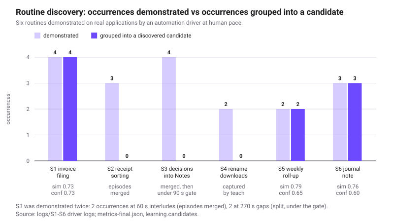
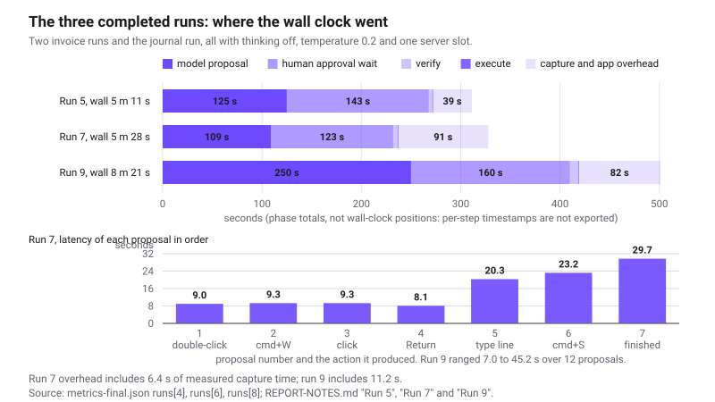
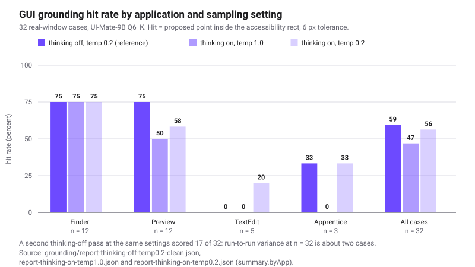
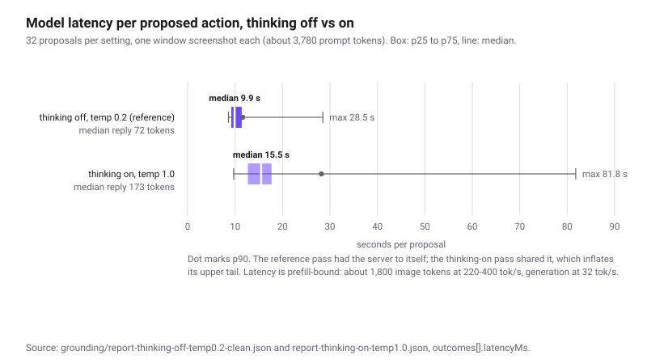

# Apprentice validation report: real applications, real local model

Date of record: 2026-09-04. Machine: one Apple M3 Max, 36 GB. Model: UI-Mate-9B Q6_K on llama.cpp
b10752, running entirely on that machine. Every number comes from an artifact produced during the
session: a run metrics export, a benchmark report, or a driver log.

## Summary

In one overnight session, six office routines were demonstrated on a real Mac by an automation
driver posting real mouse and keyboard events, and Apprentice was measured on what it learned and
how far it could carry those routines out under approval.

| Headline | Measured |
|---|---|
| Routines demonstrated | 6 routines, 20 occurrences, all completed by the driver |
| Episodes segmented from observation | 34; the final 5 demonstrations produced exactly 5 episodes, one each |
| Routines discovered passively (no human hint) | 3 of 6; a fourth captured through "Learn what I just did"; 2 not proposed |
| Guided runs with the real model | 11 runs, 69 recorded steps, 46.2 minutes of run wall time |
| Model proposals | 65; 51 executed after explicit approval; 44 deterministically verified |
| Actions executed without user approval | 0 (one low-risk action ran under an explicit per-run grant) |
| Proposals refused by the engine | 3 (2 hit-test, 1 ambiguous target) |
| Runs of human-reviewed skills carried to completion | 3 of 4 (invoice 2 of 2, journal 1 of 2), across Finder, Preview, TextEdit and Notes |
| Runs of an unreviewed discovered skill / of the taught rename skill | 0 of 1 / 0 of 3 |
| GUI grounding on 32 real-window cases | 47 to 59 percent across four passes; Finder 9 of 12 in all four |
| Median model latency per proposal | 9.9 s on the benchmark (p90 11.6 s); 9.3 s median in the fastest completed run |

## Setup

| Item | Value |
|---|---|
| Mac | Apple M3 Max, 14 CPU cores, 30 GPU cores, 36 GB unified memory, Retina 2x display |
| Runtime | llama.cpp b10752 (`llama-server`, Metal), pinned in `scripts/model-manifest.json` |
| Model | UI-Mate-9B Q6_K GGUF (7.70 GB) plus f16 mmproj (0.92 GB) |
| Provider | `uimate`, an exact port of the official agent prompt and parser |
| Context | 32,768 tokens; model image capped at 1920 px on the long edge |
| Application | the signed arm64 build produced by `pnpm package:mac` during the session |
| Other software running | Chrome, Safari, Claude desktop, Finder, Preview, TextEdit |

The routines were not typed into the app. Each was performed on the real desktop by an automation
driver posting genuine CGEvent input at human pace (2 to 4 s between actions, 100 to 180 s per
occurrence) with an idle interlude between occurrences, observed through Apprentice's normal
allowlisted path. Only afterwards was it asked what it had learned, then asked to carry it out.

## The scenarios

| ID | Routine | Apps | Occurrences | Outcome |
|---|---|---|---|---|
| S1 | File an invoice PDF into a text ledger | Finder, Preview, TextEdit | 4 | Discovered passively |
| S2 | Sort receipts into vendor folders | Finder, Preview | 3 | Not proposed: episodes merged |
| S3 | Copy meeting decisions into a Notes note | TextEdit, Notes | 2 + 2 | Not proposed: episodes merged at 60 s gaps, under the duration gate at 270 s gaps |
| S4 | Rename downloads to a date-topic convention | Finder | 2 (4 renames) | Not proposed passively; captured by teach |
| S5 | Roll daily totals up into a weekly summary | Finder, TextEdit | 2 | Discovered passively |
| S6 | Daily journal note from a template | TextEdit, Notes | 3 | Discovered passively |

## Learning results

Apprentice segmented the observation stream into 34 episodes, and the five final demonstrations
produced exactly five of them, one per occurrence. Of the eight candidates proposed, three are the
S1, S5 and S6 routines.

**S1 (invoice filing) was discovered** after the first three demonstrations produced no candidate,
for a measurable reason: they took 101 s, 50 s and 91 s of wall time but only 142 s, 52 s and 82 s
of *active* time, against a gate requiring a median above 90 s. The accumulator was closing at 60 s
of inactivity, discarding the reading pauses inside a knowledge-work routine. Raising that ceiling
to 120 s (`4da5abe`) made the routine visible: a candidate at 00:35 grouping 4 occurrences,
similarity 0.73, confidence 0.73.

**S5 (weekly roll-up) was discovered on the first pass**, at 01:54, from two occurrences separated
by a 5-minute idle gap: similarity 0.79, confidence 0.65, median 135 s, 14 steps, with a step list
that reproduces the routine faithfully. Two variables were detected, `monday` and `tuesday` at 50
percent each, but they were not merged into one slot and the kind heuristic typed both as `Date`.

**S6 (journal note from a template) was discovered from three occurrences**, at 03:12: similarity
0.76 (minimum pairwise 0.66), confidence 0.60, median 135 s, and 10 steps all at 100 percent
occurrence in the demonstrated order (open `template.txt`, TextEdit, Command+A, Command+C,
Command+W, click Notes, Command+N, Command+V). One spurious variable came from a stray click. This
is the candidate run 9 executed.

**S2 and S3 were not proposed, and the final scenarios separate the reasons.** Neither has an
outcome-bearing event: a Finder move and a Notes paste produce no save or submit, so with the short
interludes used earlier the occurrences merged into one long episode (S3: 42 events, 330 s active),
and a single episode cannot repeat. Re-running S3 and S6 with 270 s idle gaps segmented cleanly:
five occurrences, five episodes. S6 was then discovered; S3 still was not, its two episodes running
61 s and 60 s against a gate requiring a median above 90 s. The idle gap governs segmentation, a
separate duration gate filters short routines.

**S4 was captured through the teach shortcut** rather than passively. "Learn what I just did" over
a 6-minute window produced a skill with the right skeleton (select, Return, select-all, type,
Return) but not the naming convention, because typed text is never recorded. That is privacy
invariant 2 working as specified, and it bounds what passive learning can infer: the shape of a
routine, not its typed content. Run 9's note title had to come from the human reviewer for the same
reason.

**The observer records the assistant's own approved actions as if they were user activity.** The
session's highest-scoring candidate (similarity 0.90, confidence 0.82, 02:25) was built from
Apprentice executing the invoice routine itself during runs 5 and 7, and a candidate at 02:39
references the file the rename runs were working on. Guided runs therefore feed discovery, inflating
repeat counts with the system's own output; those occurrences should be excluded, or recorded as
confirmations rather than evidence for a new skill.

## Execution results

Eleven guided runs were driven with the real model against real Finder, Preview, TextEdit and Notes
windows: 46.2 minutes of wall time, 69 recorded steps.

| | Total |
|---|---|
| Proposals from the model | 65 |
| Executed after human approval | 51 |
| Deterministically verified (screen plus OCR diff) | 44 |
| Refused by the engine as `invalid_action` | 3 |
| Rejected as stale screen | 0 |
| Executed without user approval | 0 |

The three refusals are the safety path working: twice a proposed click fell on a point covered by an
unrelated window and the hit-test guard refused rather than clicking through to a foreign process;
once a Notes list item could not be pinned down and the engine refused rather than guessing.

**Three of the four runs of human-reviewed skills were carried to completion**, across Finder,
Preview, TextEdit and Notes. All ran with thinking off, temperature 0.2 and one server slot.

| | Run 5 (INV-1105) | Run 7 (INV-1106) | Run 9 (journal note) |
|---|---|---|---|
| Status | completed | completed | completed |
| Steps / proposals / executed / verified | 8 / 8 / 6 / 5 | 8 / 7 / 6 / 5 | 13 / 12 / 10 / 8 |
| Run wall time | 5 m 11 s | 5 m 28 s | 8 m 21 s |
| Model latency, median / max / total | 11.8 s / 31.7 s / 125 s | 9.3 s / 29.7 s / 109 s | 17.2 s / 45.2 s / 250 s |
| Human approval wait (not machine time) | 143 s | 123 s | 160 s |
| Helper execution, all actions | 282 ms | 268 ms | 440 ms |
| Verification | 3.5 s | 4.5 s | 8.4 s |
| Operator corrections | 2 | 1 | 2 |
| Result | correct ledger line | byte-exact ledger line | note titled "Journal 2026-09-07" plus the template text |

**Run 9 is the result the pipeline was built for.** The S6 candidate, discovered passively an hour
earlier, was promoted with "Edit and save" - the app drafted three subtasks with `app_frontmost`
predicates for TextEdit and Notes - and reviewed by a person as the product intends: intent-bearing
subtask wording, the note title "Journal 2026-09-07" added to subtask 3 because typed text is never
observed, one spurious variable removed. Structure and predicates were untouched. The run then
completed all three subtasks across three applications, from opening `template.txt` (subtask 1
closed by `app_frontmost(TextEdit)`) through the copy, the new note, the typed title and the paste.
Two steps report verification false although both succeeded, and one proposal was refused as
`target_ambiguous`.

**Run 11, a second journal note, did not complete, and the reason is a prompt gap.** Its first two
subtasks matched run 9. In subtask 3 the model proposed "click the Notes icon in the Dock" three
times running; the engine resolved each to a scroll view inside the Notes window and executed two,
verified, but the model never moved on to Command+N (9 steps, 5 m 5 s, no note). The window-scoped
screenshot shows the Notes content but not whether Notes is the active application, so the model
could not tell it had already succeeded. The engine knows the frontmost application; naming it in
the prompt would remove the ambiguity.

**Run 6 is the control for run 9.** The S5 candidate was promoted and run as-is, with no human
editing. The engine drove it correctly (4 executed actions, all verified) but nothing useful was
copied: the unedited skill hard-codes `tuesday.txt` from the last occurrence instead of binding the
variable it detected, and its subtask goals are accessibility-label sentences that omit the intent.
The model followed the literal text, faithfully. Reviewed-skill runs are 3 of 4, the unreviewed one
0 of 1: the review pass is what makes a discovered routine executable, and on run 9 it took two
minutes.

**The rename routine is 0 of 3, and the cause is in the engine, not the model.** Runs 4 and 8 both
reached the rename gesture and never got the inline editor: Return did not trigger it because the
list lacked keyboard focus, and F2 is an Ubuntu habit with no effect on macOS. Run 10 cleared the
model of suspicion: the skill was rewritten with macOS-explicit wording (click the name text, wait,
Command+A, type, Return), the model followed it exactly at 3.9 to 10.9 s per proposal, and there was
still no rename. The Finder window between steps showed why - the row carried the grey
inactive-window selection. Finder turns a file name into an editable field only if its window stays
key for about a second after the click, but in guide mode every approval brings Apprentice forward
and deactivates Finder first. **Any action whose effect depends on the target window staying key
across the approval round trip cannot succeed one step at a time.** The fix is ours: approve a short
action pair as one unit, or use an approval surface that does not take focus.

Run 8 also shows the prompt cache directly: proposals 2 to 4 returned in 3.8 to 4.5 s as
prefix-cache hits, against 21 to 27 s once several screenshots had accumulated. Run 4's latencies
are excluded, having been measured while a second benchmark shared the server.

## GUI grounding benchmark

A 32-case benchmark was built from the windows actually open on the machine, with the target rect
from the accessibility tree as ground truth: Finder 12, Preview 12, TextEdit 5, Apprentice 3; 14
buttons, 6 static texts, 3 cells, 3 pop-up buttons, 3 checkboxes, 2 menu buttons, 1 radio button. A
hit means the proposed point lands inside that rect within 6 px.

| Setting | Hit rate | Finder | Preview | TextEdit | Apprentice | Median latency | Median reply |
|---|---|---|---|---|---|---|---|
| Thinking off, temp 0.2, single slot | 19/32 (59 percent) | 9/12 | 9/12 | 0/5 | 1/3 | 9.9 s | 72 tokens |
| Thinking off, temp 0.2, earlier pass | 17/32 (53 percent) | 9/12 | 8/12 | 0/5 | 0/3 | not comparable | 71 tokens |
| Thinking on, temp 1.0 | 15/32 (47 percent) | 9/12 | 6/12 | 0/5 | 0/3 | 15.5 s | 173 tokens |
| Thinking on, temp 0.2 | 18/32 (56 percent) | 9/12 | 7/12 | 1/5 | 1/3 | not comparable | 163 tokens |

The first row is the reference pass: single-slot runtime, model otherwise idle. The two "not
comparable" rows shared the server with a second benchmark, which inflates latency but not accuracy.
The two thinking-off passes repeat one setting and differ by two cases, an estimate of run-to-run
variance at n = 32. No pass had a parse failure and the action type matched in 32 of 32 cases in the
reference pass, so the failure mode is spatial, not protocol.

Two findings hold across all four passes. First, **misses are far, not near**: the reference pass
scores 59 percent at 6 px, still 59 percent at 24 px, and 62 percent at 48 px. The model either
lands on the control or somewhere else entirely (median miss 449 px, maximum 1,427 px). Second,
**labelled targets are reliable and icon-only controls are not**: list cells scored 3/3 and static
text 4/6, while the six window-chrome traffic-light buttons were hit 1, 0, 0 and 2 times across the
four passes. TextEdit's 0 to 1 of 5 reflects its case mix: four chrome controls, one title.

Sampling temperature is not the lever, and neither is the thinking block: turning thinking off costs
no accuracy while removing about 100 completion tokens per reply. Latency is prefill-bound - about
3,780 prompt tokens per case, roughly 1,800 of them image tokens, at 220 to 400 tok/s against
generation at 32 tok/s. The screenshot dominates, which is why latency inside a run grows.

## Engineering changes this validation motivated

Active-time accounting now counts reading pauses of up to two minutes as active work (`4da5abe`),
which made the invoice routine discoverable. Subtask completion can be decided by the engine from
evidence predicates and by the operator, not only by the model (`656aa88`, `778dba3`); every
completed run used that path. Captures are window-scoped with no persisted display fallback
(`f2c54cb`), the provider honours `finish_reason` and terminal tokens and adds macOS prompt
fragments (`ce9d4c9`), the runtime uses one server slot with thinking off (`b69fbb4`), and the
grounding benchmark is a repeatable offline harness (`8d237cb`, `f69432f`).
After the last run, the proposal request started carrying the captured window's app and title
and the turn reminder now names them (`d50c180`), the fix run 11 pointed at; its live re-run is
pending.

## Follow-up the next morning

The two engine gaps that cost runs overnight were fixed and re-tested on the same machine on
the morning of 2026-09-04, after the user re-granted the macOS permissions that replacing the
app bundle had reset.

- **Frontmost application in the prompt** (`d50c180`): the proposal request now carries the
  captured window's app and title, and the turn reminder states them. Three journal runs on this
  build (runs 14, 15, 16) each left the "bring Notes to the front" step after a single click and
  went straight to Command+N; run 11 had looped three times on it.
- **Escape guard** (`62e3784`): run 15 ended as "stopped by the user" when the model pressed
  Escape to close a Notes toolbar menu it had opened. The key was serialized as `esc`, which the
  guard that lifts the global Escape shortcut did not recognise, so the app's own emergency stop
  swallowed the approved keypress. The guard now accepts both spellings, with a regression test.
- Runs 14 and 16 completed and left the expected notes ("Journal 2026-09-09" and
  "Journal 2026-09-11" followed by the template text); run 15 is the Escape case above. Wall
  times 6 m 58 s and 6 m 24 s, model 135 s in each, helper execution under 0.4 s.

Reviewed-skill runs including the follow-up: 6 of 8 completed (invoice 2 of 2, journal 4 of 6),
with both journal failures traced to engine defects that are now fixed. Export in
`docs/benchmarks/validation-runs-2026-09-04-followup.json` (runs 12 to 17 appended; runs 12 and
13 failed at the first capture or action on missing permissions and are not model results).

- **Observer** (`d0d202f`): the morning runs produced two more run-derived candidates, so the
  pipeline now stores no events while a guided run is active. A journal run on that build (run
  17, completed, 11 executed actions) added no activity events, no episodes and no candidates;
  it also exercised the Escape fix, the model closing a Notes menu it had opened and the run
  continuing.

One operational finding: deleting and re-copying the app bundle in /Applications reset the
Screen Recording and Accessibility grants for the app, while earlier in-place rebuilds had kept
them. Copy over the existing bundle instead.

## Resource and hardware requirements

The model held 11.2 to 11.7 GB of GPU memory at the 32k context, `llama-server` 8.9 to 9.8 GB
resident, the main process 150 to 170 MB, the native helper 26 to 60 MB; free memory stayed above
25 percent next to a browser and the other applications. 36 GB is comfortable, 24 GB is the
practical minimum for this quantization, 16 GB needs a smaller one or an external endpoint.
Inference is GPU-bound, so fewer GPU cores prefill proportionally slower.

## What this means

The full loop closed: a routine Apprentice discovered by watching, promoted in the app and given a
two-minute human review of its wording, was executed end to end by the local model across Finder,
TextEdit and Notes under step-by-step approval, leaving the right note behind. Around it the
measured pieces are allowlist-scoped observation; passive discovery of three routines out of six;
teach-by-shortcut; and a run loop in which the model proposes, a deterministic engine validates and
resolves the target, a human approves, a signed helper executes in tens of milliseconds, and a
screen-and-OCR diff decides whether the step worked. Across 65 proposals nothing reached the OS
without a user approval.

What is not ready. A discovered skill is not executable until a person edits its wording and binds
its variables: 3 of 4 reviewed-skill runs completed against 0 of 1 unreviewed. Discovery depends on
the idle gap, so routines repeated across short interludes merge into one episode, and routines
under 90 s of active work are filtered out even when segmented correctly. The observer treats the
assistant's own approved actions as user activity, so guided runs feed discovery. Verification has
no signal for copy, paste or save actions that change nothing in the compared pixels. Two engine
gaps cost runs directly: the approval surface takes focus, so a gesture needing the target window to
stay key cannot be driven step by step (rename, 0 of 3), and the prompt never names the frontmost
application, so the model can repeat an action it has already completed (run 11). Grounding accuracy
sits between 47 and 59 percent at 6 px, and latency grows with the run, 7 s for the first proposals
against 45 s once ten screenshots are kept. A guided run is a supervised assistant, not a background
worker.

The next steps follow directly: a frontmost-application line in the prompt; an approval path that
keeps the target window key, by approving a short action pair as one unit or by not taking focus;
intent-bearing subtask text and variable binding generated at promotion; an outcome-event boundary
signal and a lower duration gate; excluding assistant-executed occurrences from discovery;
clipboard- and file-level verification predicates; and an accessibility-first resolver that uses the
model for disambiguation rather than for pixel coordinates on controls the tree already names.